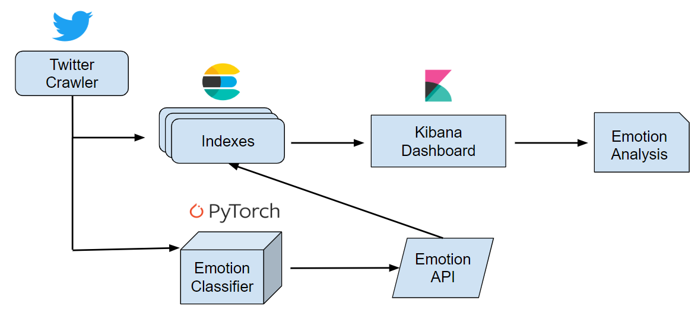

## Emotion Analysis with Elastic and PyTorch

The objective of this project is to integrate real-time search and analytics technologies such as Elasticsearch and Kibana, while leveraging the inferences from deep learning frameworks such as PyTorch. With this integration it is possible to build a holistic NLP system that streamlines emotion analysis research and helps to answer interesting research questions and hypotheses through automated linguistic analyses, visualizations, and inferences. The figure above illustrates the system we intend to build in this project.

## The Dataset
Due to Twitter TOS I am not allowed to publicly share the datasets here. However, you can **directly request** the datasets by emailing me at ellfae@gmail.com.

## Word Embeddings
The emotion classifier in this project makes use of pretrained word embeddings. I have provided the code in "Ch1_PyTorch_CBOW_embeddings.ipynb" to pre-train your own embeddings for your dataset. Alternatively, you can use pretrained word embeddings from Word2vec or GLoVe or even ELMo embeddings. If you would like access to my pretrained embeddings, you can find them [here](https://www.dropbox.com/sh/d3sgvfwixpza7li/AABFnEAfajzz1hZ9cKRu-wMoa?dl=0). Note that they may need further fine-tuning, but you can just use them to test out the code in the notebooks.

## The Classifier
After we have trained the word embeddings, it is time to train the classifier and store it for later use. In the "Ch2_PyTorch_classifier.ipynb" notebook I show all the details of how to achieve this.

## Elasticsearch Indexing
In this project we will be pulling real-time data from the Twitter API, pre-processing it, analyzing it, and indexing it to Elasticsearch. Thus, the crawler code found in "Ch3_Elasticsearch_indexing.ipynb" will achieve these steps. You can find more details on how to configure your Twitter crawler [here](https://github.com/IDEA-NTHU-Taiwan/twitter_crawler_by_keywords).

## Kibana Analytics
After indexing the classified tweets, I conduct further extensive analysis using Kibana. This part of the project will be uploaded soon. But if you have some expertise in Kibana you can just configure th index and start to create visualizations right away. I am performing complex emotion analysis as part of my work, thus I go the extra mile to find out more about the dataset and try to understand emotion from very different perspectives. All this stuff will be incorporated into this project soon! Take a look at these [preliminary slides](https://docs.google.com/presentation/d/1OFNKZwFyQq0BBxL7ABOosk2hAPul3jMpZj4jNmZNcMA/edit?usp=sharing) to get a feel for what other stuff you can expect to see in this project in the future.

## Future Vision
The future vision of this project is to build a system as proposed in the poster below. This project was presented at the first PyTorch Developer Conference in San Francisco. It's an ongoing project with so many different layers of abstractions that help data scientist and machine learning enthusiast learn about search and analytics technologies, in particular how it is applied to emotion analysis. 

## Todo
This is an ongoing project and these are the future additions I am working on:
- Build PyTorch-based Emotion Recognition API
- Integrate Logstash with the Emotion API
    - This avoids the need of a standalone crawler
    - We can also store tweets in bulk rather than by single tweets as is currently being done
- Incorporate Opennlp plugin for the NLP part
- Refactor code a bit
    - Create scripts to hold classes and functions
